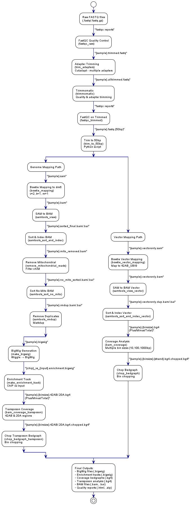

# ChIP-seq Analysis Pipeline (Snakemake)

A reproducible ChIP-seq analysis pipeline converted from shell commands to Snakemake workflow.

**✅ Production Ready**: This pipeline is fully functional and has been tested with multiple datasets. It provides a complete ChIP-seq analysis workflow from raw data to publication-ready results.

> **🚀 Quick Start**: Use the unified workflow manager from the project root:
> ```bash
> ./run_workflow.sh 1 check-inputs    # Validate requirements
> ./run_workflow.sh 1                 # Run with interactive guidance
> ```
> For details, see [WORKFLOW_MANAGER.md](../WORKFLOW_MANAGER.md).

## 🆕 Recent Improvements

- **✅ Parameterized Paths**: No more symlinks needed - use `INPUT_DATA_DIR` variable to specify input file location
- **✅ Flexible Results Directory**: Customize output directory name with `RESULTS_DIR` variable (e.g., `results_White_GLKD`)
- **✅ Enhanced Error Handling**: Fixed FastQC output naming issues and improved Snakemake syntax
- **✅ Simplified Usage**: Convenient alias setup (`alias sm='snakemake --use-conda --cores 8'`)
- **✅ Better Documentation**: Updated troubleshooting guide and configuration examples

## Overview

This pipeline processes ChIP-seq data from raw FASTQ files to BigWig visualization tracks and enrichment analysis. It includes quality control, adapter trimming, read mapping, duplicate removal, and ChIP-vs-Input enrichment analysis.

## Features

- **Reproducible**: Conda environments for all dependencies
- **Scalable**: Parallel processing with Snakemake
- **Quality Control**: FastQC integration at multiple steps
- **Flexible**: Supports multiple samples and comparisons
- **Modern**: Updated to Python 3 and current software versions

## Workflow Overview



*The ChIP-seq workflow processes raw FASTQ files through quality control, adapter trimming, read mapping (both genome and vector), and generates BigWig tracks, enrichment analysis, and coverage analysis at multiple resolutions.*

### Key Dependencies
- **Quality Control**: Must pass before mapping
- **Mapping**: Requires both genome and vector indexes
- **Coverage**: Depends on successful mapping
- **Enrichment**: Requires both ChIP and Input samples

### Workflow Diagram
The workflow diagram above shows the complete ChIP-seq analysis pipeline with **specific output file names and types**. The diagram is generated from the PlantUML source file located at `../Shared/Scripts/plantuml/chipseq_workflow.puml`. 

**Key Features of the Updated Diagram:**
- ✅ **Specific File Names**: Shows actual output file naming conventions (e.g., `{sample}.alltrimmed_fastqc.html`)
- ✅ **File Types**: Displays all major file types (.fastq, .bam, .bigwig, .bg4, .html)
- ✅ **Branching Paths**: Illustrates parallel genome and vector mapping workflows
- ✅ **Output Summary**: Includes a note with key final output files

To regenerate the image or modify the workflow visualization, edit the PUML file and run:
```bash
cd ../Shared/Scripts/plantuml
plantuml -tpng chipseq_workflow.puml -o ../../DataFiles/workflow_images/
```

## Quick Start

### 1. Prerequisites

```bash
# Install mamba for faster environment creation
conda install mamba -n base -c conda-forge

# Create and activate the base environment
mamba create -n snakemake_env snakemake
conda activate snakemake_env
```

### 2. Setup

```bash
# Clone the repository
git clone <repository-url>
cd chipseq-workflow

# Download required data files (see Data Download section below)
# Snakemake will create tool environments automatically
```

### 3. Run the Pipeline

```bash
# Activate the environment
conda activate snakemake_env

# Set up convenient alias
alias sm='snakemake --use-conda --cores 8'

# Run the complete pipeline
sm

# Or run with specific number of cores
snakemake --use-conda --cores 24

# Dry run to check what will be executed
sm -n
```

## Data Requirements

### Required Files

1. **Reference Genome**: `dm6.fa`
2. **Bowtie Index**: `bowtie-indexes/dm6/` (built from dm6.fa)
3. **Chromosome Sizes**: `../Shared/DataFiles/genome/bowtie-indexes/dm6.chrom.sizes`
4. **Blacklist**: `dm6-blacklist.v2.bed.gz`
5. **Adapter File**: `AllAdaptors.fa`
6. **Vector Reference**: `../Shared/DataFiles/genome/YichengVectors/42AB_UBIG.fa`
7. **Input FASTQ Files**: Located in `INPUT_DATA_DIR` (configurable path)

### File Sources

- **dm6.fa**: Drosophila melanogaster reference genome (dm6 assembly)
- **dm6.chrom.sizes**: Generated from dm6.fa using `samtools faidx`
- **dm6-blacklist.v2.bed.gz**: [Boyle-Lab Blacklist](https://github.com/Boyle-Lab/Blacklist/)
- **AllAdaptors.fa**: [Peng-He-Lab Repository](https://github.com/Peng-He-Lab/Luo_2025_piRNA/tree/main/DataFiles)
- **42AB_UBIG.fa**: [Peng-He-Lab Repository](https://github.com/Peng-He-Lab/Luo_2025_piRNA/tree/main/DataFiles)

### Data Download

```bash
# Download reference genome (dm6)
wget https://hgdownload.soe.ucsc.edu/goldenPath/dm6/bigZips/dm6.fa.gz
gunzip dm6.fa.gz

# Download blacklist file
wget https://github.com/Boyle-Lab/Blacklist/raw/master/lists/dm6-blacklist.v2.bed.gz

# Download adapter and vector files from Peng-He-Lab repository
wget https://raw.githubusercontent.com/Peng-He-Lab/Luo_2025_piRNA/main/DataFiles/AllAdaptors.fa
wget https://raw.githubusercontent.com/Peng-He-Lab/Luo_2025_piRNA/main/DataFiles/42AB_UBIG.fa

# Create chromosome sizes file
samtools faidx dm6.fa
cut -f1,2 dm6.fa.fai > ../Shared/DataFiles/genome/bowtie-indexes/dm6.chrom.sizes

# Build Bowtie index
mkdir -p bowtie-indexes/dm6
bowtie-build dm6.fa bowtie-indexes/dm6/dm6

# Create vector index directory
mkdir -p ../Shared/DataFiles/genome/YichengVectors
bowtie-build ../Shared/DataFiles/genome/YichengVectors/42AB_UBIG.fa ../Shared/DataFiles/genome/YichengVectors/42AB_UBIG
```

**Note**: You may need to download your own FASTQ files or use the provided SRR030295.fastq and SRR030270.fastq files.

## Pipeline Steps

### 1. Quality Control
- **FastQC**: Quality assessment of raw reads
- **Adapter Trimming**: Remove sequencing adapters with cutadapt
- **Quality Trimming**: Filter low-quality reads with Trimmomatic
- **Length Trimming**: Trim reads to 50bp for consistency

### 2. Read Mapping
- **Genome Mapping**: Map reads to dm6 reference with Bowtie
- **Vector Mapping**: Map reads to vector sequences
- **SAM to BAM**: Convert and sort alignment files
- **Mitochondrial Removal**: Remove chrM reads
- **Duplicate Removal**: Remove PCR duplicates

### 3. Signal Generation
- **BigWig Creation**: Generate signal tracks for visualization
- **Enrichment Analysis**: Create ChIP-vs-Input enrichment tracks

## Data Quality Assessment

### FastQC Reports

The pipeline generates FastQC reports for quality assessment:

```bash
# View FastQC reports (if running locally)
google-chrome {RESULTS_DIR}/fastqc_trimmed/{CHIP_SAMPLE}.alltrimmed_fastqc.html
google-chrome {RESULTS_DIR}/fastqc_trimmed/{INPUT_SAMPLE}.alltrimmed_fastqc.html

# If running on remote server via SSH:
# Option 1: Port forwarding
ssh -L 8080:localhost:8080 username@server
cd {RESULTS_DIR}/fastqc_trimmed/
python3 -m http.server 8080
# Then open http://localhost:8080/{CHIP_SAMPLE}.alltrimmed_fastqc.html in local browser

# Option 2: Copy files to local machine
scp username@server:/path/to/chipseq-workflow/{RESULTS_DIR}/fastqc_trimmed/*.html ./
google-chrome {CHIP_SAMPLE}.alltrimmed_fastqc.html
```

### Quality Metrics to Monitor

- **Per Base Sequence Quality**: Should be >20 for most positions
- **Per Sequence Quality Scores**: Median should be >30
- **Per Base Sequence Content**: Should be relatively uniform
- **GC Content**: Should match expected distribution for your organism
- **Sequence Length Distribution**: Should be consistent after trimming
- **Sequence Duplication Levels**: Lower is better (indicates good library complexity)

### Expected Results

- **Mapping Rate**: >70% for ChIP-seq data
- **Duplicate Rate**: <20% for good quality data
- **Enrichment**: ChIP sample should show clear peaks vs Input control

## Output Files

### Main Outputs
```
{RESULTS_DIR}/                     # Configurable output directory name
├── bowtie/
│   ├── {CHIP_SAMPLE}.bigwig      # ChIP signal track
│   ├── {INPUT_SAMPLE}.bigwig     # Input signal track
│   └── *.bam                     # Processed alignment files
├── enrichment/
│   └── {CHIP_SAMPLE}_vs_{INPUT_SAMPLE}.enrichment.bigwig  # Enrichment track
├── fastqc_trimmed/               # Quality control reports
│   └── *.alltrimmed_fastqc.html  # FastQC reports (note: .alltrimmed naming)
├── vector_mapping/               # Vector mapping results
├── coverage/                     # Coverage analysis at different bin sizes
│   ├── *.10.bg4                 # 10bp bin coverage
│   ├── *.100.bg4                # 100bp bin coverage
│   ├── *.1000.bg4               # 1000bp bin coverage
│   └── *.chopped.bg4            # Chopped coverage files (optional)
└── transposon/                   # Transposon-specific analysis
    ├── *.42AB.bg4               # 42AB transposon coverage
    └── *.chopped.bg4            # Chopped transposon files (optional)
```

### File Descriptions
- **`.bigwig`**: Signal tracks for genome browser visualization
- **`.bam`**: Processed alignment files with indexes
- **`enrichment.bigwig`**: ChIP-vs-Input comparison track
- **`.bg4`**: Coverage files in BEDGraph4 format for detailed analysis
- **`chopped.bg4`**: Processed coverage files for downstream analysis
- **`42AB.bg4`**: Coverage specific to 42AB transposon elements
- **`20A.bg4`**: Coverage specific to 20A transposon elements

## Configuration

### Sample Configuration

The pipeline now supports flexible configuration with centralized variables. Edit `Snakefile` to configure your analysis:

```python
# Input data files - specify where your FASTQ files are located
INPUT_DATA_DIR = f"{SHARED_DATA}/datasets/chip-seq/chip_inputs"

# Results directory configuration - customize your output directory
RESULTS_DIR = "results_White_GLKD"  # Can be any name you prefer

# Sample configuration
CHIP_SAMPLE = "White_GLKD_ChIP_input_1st_S7_R1_001"    # Your ChIP sample
INPUT_SAMPLE = "White_GLKD_ChIP_input_2nd_S10_R1_001"  # Your Input control
SAMPLES = [CHIP_SAMPLE, INPUT_SAMPLE]
```

**New Configuration Features:**
- **`INPUT_DATA_DIR`**: Centralized input file location (no symlinks needed)
- **`RESULTS_DIR`**: Customizable output directory name 
- **Path Variables**: All file paths are now parameterized for easy maintenance

### Analysis Parameters

The pipeline includes configurable parameters for coverage and transposon analysis:

```python
BIN_SIZES = [10, 100, 1000]                    # Coverage analysis bin sizes
TRANSPOSON_BIN_SIZES = [10, 50, 100, 500, 1000]  # Transposon analysis bin sizes
```

- **Coverage Analysis**: Generates coverage files at 10bp, 100bp, and 1000bp resolutions
- **Transposon Analysis**: Analyzes 42AB and 20A transposon elements at multiple resolutions
- **Strand-specific Analysis**: Separate coverage files for plus and minus strands

### Environment Files

The pipeline uses conda environments defined in `envs/`:
- `envs/deeptools.yaml`: DeepTools for enrichment analysis
- `envs/samtools-1.16.1.yaml`: Samtools for BAM processing
- `envs/bowtie.yaml`: Bowtie for read mapping
- `envs/trimmomatic.yaml`: Trimmomatic for quality trimming
- `envs/fastqc.yaml`: FastQC for quality control
- `envs/cutadapt.yaml`: Cutadapt for adapter trimming
- `envs/bedops.yaml`: BEDOPS for genomic operations
- `envs/macs2-2.1.0.yaml`: MACS2 for peak calling

## Usage Examples

### Basic Run
```bash
# Set up alias for convenience
alias sm='snakemake --use-conda --cores 8'
sm
```

### Force Re-run All Steps
```bash
sm --forceall
```

### Run Specific Rule
```bash
sm make_enrichment_track
```

### Dry Run (Check What Will Be Run)
```bash
sm -n
# or
sm --dry-run
```

### Clean Up
```bash
sm --cleanup-metadata
```

### Advanced Usage
```bash
# Use more cores for faster processing
snakemake --use-conda --cores 24

# Use mamba for faster environment creation
snakemake --use-conda --conda-frontend mamba --cores 8

# Run with higher latency wait for network filesystems
sm --latency-wait 60
```

## Troubleshooting

### Common Issues

1. **Snakemake Environment Setup**
   ```bash
   # First create and activate the snakemake environment
   conda create -n snakemake_env snakemake
   conda activate snakemake_env
   
   # Then run the pipeline (Snakemake will create tool environments automatically)
   snakemake --use-conda --cores 4
   
   # Use alias for convenience
   alias sm='snakemake --use-conda --cores 8'
   sm
   ```

2. **Memory Issues**
   ```bash
   # Reduce number of cores
   snakemake --use-conda --conda-frontend mamba --cores 4
   ```

3. **File Not Found Errors**
   ```bash
   # Check file paths in Snakefile
   # Ensure all required files are present
   ls -la dm6.fa AllAdaptors.fa
   ```

4. **Python Version Issues**
   ```bash
   # Check Snakemake version
snakemake --version

# Note: Python versions are managed by individual tool environments
# Each rule uses its own environment with the appropriate Python version
   ```

5. **Coverage Analysis Issues**
   ```bash
   # Check if BEDOPS is properly installed
   bedops --version
   
   # Verify input BAM files exist
   ls -la results/bowtie/*.bam
   ```

6. **Transposon Analysis Issues**
   ```bash
   # Check if vector files exist
   ls -la ../Shared/DataFiles/genome/YichengVectors/
   
   # Verify vector indexes are built
   ls -la ../Shared/DataFiles/genome/YichengVectors/*.ebwt
   ```

7. **Memory Issues with Large Files**
   ```bash
   # Use fewer cores for memory-intensive operations
   snakemake --use-conda --conda-frontend mamba --cores 2 make_coverage
   
   # Check available memory
   free -h
   ```

8. **FastQC Output Naming Issues**
   ```bash
   # FastQC creates files with .alltrimmed_fastqc.html suffix
   # If you see MissingOutputException for fastqc files, check that rule outputs match:
   # Expected: {sample}.alltrimmed_fastqc.html
   # Not: {sample}_fastqc.html
   
   # Verify FastQC outputs exist
   ls -la {RESULTS_DIR}/fastqc_trimmed/
   ```

### Debug Mode

```bash
# Run with verbose output
snakemake --use-conda --conda-frontend mamba --cores 24 --verbose

# Check specific rule execution
snakemake --use-conda --conda-frontend mamba --cores 24 make_bigwig --verbose
```

## Performance Optimization

### Recommended System Requirements
- **CPU**: 8+ cores for optimal performance (24+ cores for server environments)
- **Memory**: 16GB+ RAM (32GB recommended for large datasets)
- **Storage**: 50GB+ free space (100GB+ for multiple samples)
- **Time**: 2-4 hours per sample (faster with more cores)

### Resource Monitoring

```bash
# Monitor CPU and memory usage
htop

# Monitor disk usage
df -h

# Monitor Snakemake progress
snakemake --use-conda --conda-frontend mamba --cores 24 --verbose

# Check specific rule resource usage
snakemake --use-conda --conda-frontend mamba --cores 24 make_bigwig --verbose
```

### Performance Tips
1. **Use SSD storage** for faster I/O
2. **Increase cores** for parallel processing
3. **Monitor memory usage** during peak operations (BAM processing, BigWig generation)
4. **Use `--cores`** to limit resource usage
5. **Consider mamba** for large/complex environments: `--conda-frontend mamba`
6. **Use `--latency-wait`** for network file systems: `--latency-wait 60`
7. **Clean up intermediate files** periodically to save disk space

## Biological Context

### Sample Types
- **Current Example**: White GLKD ChIP-seq experiment
  - **ChIP Sample**: White_GLKD_ChIP_input_1st_S7_R1_001
  - **Input Control**: White_GLKD_ChIP_input_2nd_S10_R1_001
- **Historical Example**: H3K27Ac ChIP-seq (SRR030295/SRR030270)

### Analysis Purpose
- **H3K27Ac**: Marks active enhancers and promoters
- **Input Control**: Provides background signal for normalization
- **Enrichment Analysis**: Identifies regions with significant ChIP signal

### Expected Results
- **BigWig files**: Visualize signal intensity across genome
- **Enrichment track**: Shows peaks where H3K27Ac is enriched
- **Quality metrics**: Assess data quality and processing success

## Results Interpretation

### BigWig Files

The pipeline generates BigWig files for visualization in genome browsers:

```bash
# Load in IGV or UCSC Genome Browser
{RESULTS_DIR}/bowtie/{CHIP_SAMPLE}.bigwig    # ChIP signal
{RESULTS_DIR}/bowtie/{INPUT_SAMPLE}.bigwig   # Input signal
{RESULTS_DIR}/enrichment/{CHIP_SAMPLE}_vs_{INPUT_SAMPLE}.enrichment.bigwig  # Enrichment
```

### Enrichment Analysis

The enrichment track shows regions where ChIP signal is significantly higher than Input:
- **Positive values**: Regions enriched in ChIP sample
- **Negative values**: Regions depleted in ChIP sample
- **Peak calling**: Use MACS2 or similar tools for formal peak detection

### Coverage Analysis

The `.bg4` files provide detailed coverage information:
- **10bp bins**: High-resolution coverage for detailed analysis
- **100bp bins**: Medium resolution for general trends
- **1000bp bins**: Low resolution for broad patterns
- **Strand-specific**: Separate files for plus and minus strands

### Transposon Analysis

Specialized analysis for transposon elements:
- **42AB elements**: Specific transposon family analysis
- **20A elements**: Another transposon family
- **Multiple resolutions**: Analysis at different bin sizes for different purposes

## Citation

If you use this pipeline, please cite:

### Original Work
- **Peng-He-Lab ChIP-seq Pipeline**: Based on the [Peng-He-Lab/Luo_2025_piRNA repository](https://github.com/Peng-He-Lab/Luo_2025_piRNA/blob/main/ChIP-seq.md)

### Software Tools
- **Snakemake**: Köster, J., & Rahmann, S. (2012). Snakemake—a scalable bioinformatics workflow engine. Bioinformatics, 28(19), 2520-2522.
- **DeepTools**: Ramírez, F., et al. (2016). deepTools2: a next generation web server for deep-sequencing data analysis. Nucleic acids research, 44(W1), W160-W165.
- **Bowtie**: Langmead, B., et al. (2009). Ultrafast and memory-efficient alignment of short DNA sequences to the human genome. Genome biology, 10(3), R25.

## Related Documentation

- **[Main Project README](../README.md)**: Overview of the entire piRNA workflow project
- **[Quick Setup Guide](QUICK_SETUP.md)**: Fast setup instructions
- **[Dataset Recommendations](DATASET_RECOMMENDATIONS.md)**: Data quality guidelines and recommendations

## Contributing

1. Fork the repository
2. Create a feature branch
3. Make your changes
4. Test thoroughly
5. Submit a pull request

## License

This project is licensed under the MIT License - see the LICENSE file for details.

## Support

For issues and questions:
1. Check the troubleshooting section above
2. Review the CHANGELOG.md for recent changes
3. Open an issue on the repository
4. Contact the development team

## Acknowledgments

- **Peng-He-Lab**: Original ChIP-seq pipeline development and methodology
- **Snakemake community**: Workflow engine and best practices
- **Bioconda contributors**: Software packaging and distribution
- **Open-source bioinformatics community**: Tools and resources
