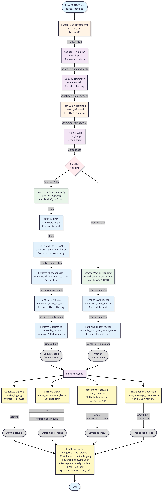

# ChIP-seq Analysis Pipeline (Snakemake)

A reproducible ChIP-seq analysis pipeline converted from shell commands to Snakemake workflow.

> **Note**: A unified workflow manager (`./run_workflow.sh`) is available from the project root, providing interactive guidance, automatic resource detection, input validation, and error recovery. See [WORKFLOW_MANAGER.md](../WORKFLOW_MANAGER.md) for details.

## Overview

This pipeline processes ChIP-seq data from raw FASTQ files to BigWig visualization tracks and enrichment analysis. It includes quality control, adapter trimming, read mapping, duplicate removal, and ChIP-vs-Input enrichment analysis.

## Features

- **Reproducible**: Conda environments for all dependencies
- **Scalable**: Parallel processing with Snakemake
- **Quality Control**: FastQC integration at multiple steps
- **Flexible**: Supports multiple samples and comparisons

## Workflow Overview



*The ChIP-seq workflow processes raw FASTQ files through quality control, adapter trimming, read mapping (both genome and vector), and generates BigWig tracks, enrichment analysis, and coverage analysis at multiple resolutions.*

### Key Dependencies
- **Quality Control**: Must pass before mapping
- **Mapping**: Requires both genome and vector indexes
- **Coverage**: Depends on successful mapping
- **Enrichment**: Requires both ChIP and Input samples

## Direct Snakemake Usage

For advanced users who prefer to run Snakemake directly (instead of using the workflow manager):

```bash
# Activate the snakemake environment
conda activate snakemake_env

# Run the complete pipeline
snakemake --use-conda --cores 8

# Dry run to check what will be executed
snakemake --use-conda --cores 8 --dry-run

# Use mamba for faster environment creation
snakemake --use-conda --conda-frontend mamba --cores 8
```

## Data Requirements

### Required Files

1. **Reference Genome**: `dm6.fa`
2. **Bowtie Index**: `bowtie-indexes/dm6/` (built from dm6.fa)
3. **Chromosome Sizes**: `../Shared/DataFiles/genome/bowtie-indexes/dm6.chrom.sizes`
4. **Blacklist**: `dm6-blacklist.v2.bed.gz`
5. **Adapter File**: `AllAdaptors.fa`
6. **Vector Reference**: `../Shared/DataFiles/genome/YichengVectors/42AB_UBIG.fa`
7. **Input FASTQ Files**: Located in `INPUT_DATA_DIR` (configurable path)

### File Sources

- **dm6.fa**: Drosophila melanogaster reference genome (dm6 assembly)
- **dm6.chrom.sizes**: Generated from dm6.fa using `samtools faidx`
- **dm6-blacklist.v2.bed.gz**: [Boyle-Lab Blacklist](https://github.com/Boyle-Lab/Blacklist/)
- **AllAdaptors.fa**: [Peng-He-Lab Repository](https://github.com/Peng-He-Lab/Luo_2025_piRNA/tree/main/DataFiles)
- **42AB_UBIG.fa**: [Peng-He-Lab Repository](https://github.com/Peng-He-Lab/Luo_2025_piRNA/tree/main/DataFiles)

### Data Download

```bash
# Download reference genome (dm6)
wget https://hgdownload.soe.ucsc.edu/goldenPath/dm6/bigZips/dm6.fa.gz
gunzip dm6.fa.gz

# Download blacklist file
wget https://github.com/Boyle-Lab/Blacklist/raw/master/lists/dm6-blacklist.v2.bed.gz

# Download adapter and vector files from Peng-He-Lab repository
wget https://raw.githubusercontent.com/Peng-He-Lab/Luo_2025_piRNA/main/DataFiles/AllAdaptors.fa
wget https://raw.githubusercontent.com/Peng-He-Lab/Luo_2025_piRNA/main/DataFiles/42AB_UBIG.fa

# Create chromosome sizes file
samtools faidx dm6.fa
cut -f1,2 dm6.fa.fai > ../Shared/DataFiles/genome/bowtie-indexes/dm6.chrom.sizes

# Build Bowtie index
mkdir -p bowtie-indexes/dm6
bowtie-build dm6.fa bowtie-indexes/dm6/dm6

# Create vector index directory
mkdir -p ../Shared/DataFiles/genome/YichengVectors
bowtie-build ../Shared/DataFiles/genome/YichengVectors/42AB_UBIG.fa ../Shared/DataFiles/genome/YichengVectors/42AB_UBIG
```

**Note**: You may need to download your own FASTQ files or use the provided SRR030295.fastq and SRR030270.fastq files.

## Pipeline Steps

### 1. Quality Control
- **FastQC**: Quality assessment of raw reads
- **Adapter Trimming**: Remove sequencing adapters with cutadapt
- **Quality Trimming**: Filter low-quality reads with Trimmomatic
- **Length Trimming**: Trim reads to 50bp for consistency

### 2. Read Mapping
- **Genome Mapping**: Map reads to dm6 reference with Bowtie
- **Vector Mapping**: Map reads to vector sequences
- **SAM to BAM**: Convert and sort alignment files
- **Mitochondrial Removal**: Remove chrM reads
- **Duplicate Removal**: Remove PCR duplicates

### 3. Signal Generation
- **BigWig Creation**: Generate signal tracks for visualization
- **Enrichment Analysis**: Create ChIP-vs-Input enrichment tracks

## Data Quality Assessment

### FastQC Reports

The pipeline generates FastQC reports for quality assessment:

```bash
# View FastQC reports (if running locally)
google-chrome {RESULTS_DIR}/fastqc_trimmed/{CHIP_SAMPLE}.alltrimmed_fastqc.html
google-chrome {RESULTS_DIR}/fastqc_trimmed/{INPUT_SAMPLE}.alltrimmed_fastqc.html

# If running on remote server via SSH:
# Option 1: Port forwarding
ssh -L 8080:localhost:8080 username@server
cd {RESULTS_DIR}/fastqc_trimmed/
python3 -m http.server 8080
# Then open http://localhost:8080/{CHIP_SAMPLE}.alltrimmed_fastqc.html in local browser

# Option 2: Copy files to local machine
scp username@server:/path/to/chipseq-workflow/{RESULTS_DIR}/fastqc_trimmed/*.html ./
google-chrome {CHIP_SAMPLE}.alltrimmed_fastqc.html
```

### Quality Metrics to Monitor

- **Per Base Sequence Quality**: Should be >20 for most positions
- **Per Sequence Quality Scores**: Median should be >30
- **Per Base Sequence Content**: Should be relatively uniform
- **GC Content**: Should match expected distribution for your organism
- **Sequence Length Distribution**: Should be consistent after trimming
- **Sequence Duplication Levels**: Lower is better (indicates good library complexity)

### Expected Results

- **Mapping Rate**: >70% for ChIP-seq data
- **Duplicate Rate**: <20% for good quality data
- **Enrichment**: ChIP sample should show clear peaks vs Input control

## Output Files

### Main Outputs
```
{RESULTS_DIR}/                     # Configurable output directory name
├── bowtie/
│   ├── {CHIP_SAMPLE}.bigwig      # ChIP signal track
│   ├── {INPUT_SAMPLE}.bigwig     # Input signal track
│   └── *.bam                     # Processed alignment files
├── enrichment/
│   └── {CHIP_SAMPLE}_vs_{INPUT_SAMPLE}.enrichment.bigwig  # Enrichment track
├── fastqc_trimmed/               # Quality control reports
│   └── *.alltrimmed_fastqc.html  # FastQC reports (note: .alltrimmed naming)
├── vector_mapping/               # Vector mapping results
├── coverage/                     # Coverage analysis at different bin sizes
│   ├── *.10.bg4                 # 10bp bin coverage
│   ├── *.100.bg4                # 100bp bin coverage
│   ├── *.1000.bg4               # 1000bp bin coverage
│   └── *.chopped.bg4            # Chopped coverage files (optional)
└── transposon/                   # Transposon-specific analysis
    ├── *.42AB.bg4               # 42AB transposon coverage
    └── *.chopped.bg4            # Chopped transposon files (optional)
```

### File Descriptions
- **`.bigwig`**: Signal tracks for genome browser visualization
- **`.bam`**: Processed alignment files with indexes
- **`enrichment.bigwig`**: ChIP-vs-Input comparison track
- **`.bg4`**: Coverage files in BEDGraph4 format for detailed analysis
- **`chopped.bg4`**: Processed coverage files for downstream analysis
- **`42AB.bg4`**: Coverage specific to 42AB transposon elements
- **`20A.bg4`**: Coverage specific to 20A transposon elements

## Configuration

### Sample Configuration

The pipeline uses a modern `config.yaml` file for easy configuration. Edit `config.yaml` to customize your analysis:

```yaml
# Sample configuration
samples:
  chip: "White_GLKD_ChIP_input_1st_S7_R1_001"    # ChIP sample
  input: "White_GLKD_ChIP_input_2nd_S10_R1_001"  # Input control sample

# Input data
input_data:
  data_dir: "../Shared/DataFiles/datasets/chip-seq/chip_inputs"

# Output directories
output:
  results_dir: "results"

# Analysis parameters
analysis:
  bin_sizes: [10, 100, 1000]
  transposon_bin_sizes: [10, 50, 100, 500, 1000]
```

**Configuration Features:**
- **`config.yaml`**: Modern YAML-based configuration (no need to edit Snakefile)
- **Sample Management**: Easy to change samples without touching code
- **Path Configuration**: Centralized file path management
- **Analysis Parameters**: Configurable bin sizes and analysis settings

### Analysis Parameters

The pipeline includes configurable parameters for coverage and transposon analysis:

```python
BIN_SIZES = [10, 100, 1000]                    # Coverage analysis bin sizes
TRANSPOSON_BIN_SIZES = [10, 50, 100, 500, 1000]  # Transposon analysis bin sizes
```

- **Coverage Analysis**: Generates coverage files at 10bp, 100bp, and 1000bp resolutions
- **Transposon Analysis**: Analyzes 42AB and 20A transposon elements at multiple resolutions
- **Strand-specific Analysis**: Separate coverage files for plus and minus strands

### Environment Files

The pipeline uses conda environments defined in `envs/`:
- `envs/deeptools.yaml`: DeepTools for enrichment analysis
- `envs/samtools-1.16.1.yaml`: Samtools for BAM processing
- `envs/bowtie.yaml`: Bowtie for read mapping
- `envs/trimmomatic.yaml`: Trimmomatic for quality trimming
- `envs/fastqc.yaml`: FastQC for quality control
- `envs/cutadapt.yaml`: Cutadapt for adapter trimming
- `envs/bedops.yaml`: BEDOPS for genomic operations
- `envs/macs2-2.1.0.yaml`: MACS2 for peak calling

## Performance Optimization

### Recommended System Requirements
- **CPU**: 8+ cores recommended
- **Memory**: 16GB+ RAM
- **Storage**: 50GB+ free space
- **Time**: 2-4 hours per sample (depends on cores and data size)

### Tips
- Use `--cores` to control parallelization
- Use `--conda-frontend mamba` for faster environment creation
- Use `--latency-wait 60` for network file systems

## Biological Context

### Sample Types
- **Current Example**: White GLKD ChIP-seq experiment
  - **ChIP Sample**: White_GLKD_ChIP_input_1st_S7_R1_001
  - **Input Control**: White_GLKD_ChIP_input_2nd_S10_R1_001
- **Historical Example**: H3K27Ac ChIP-seq (SRR030295/SRR030270)

### Analysis Purpose
- **H3K27Ac**: Marks active enhancers and promoters
- **Input Control**: Provides background signal for normalization
- **Enrichment Analysis**: Identifies regions with significant ChIP signal

### Expected Results
- **BigWig files**: Visualize signal intensity across genome
- **Enrichment track**: Shows peaks where H3K27Ac is enriched
- **Quality metrics**: Assess data quality and processing success

## Results Interpretation

### BigWig Files

The pipeline generates BigWig files for visualization in genome browsers:

```bash
# Load in IGV or UCSC Genome Browser
{RESULTS_DIR}/bowtie/{CHIP_SAMPLE}.bigwig    # ChIP signal
{RESULTS_DIR}/bowtie/{INPUT_SAMPLE}.bigwig   # Input signal
{RESULTS_DIR}/enrichment/{CHIP_SAMPLE}_vs_{INPUT_SAMPLE}.enrichment.bigwig  # Enrichment
```

### Enrichment Analysis

The enrichment track shows regions where ChIP signal is significantly higher than Input:
- **Positive values**: Regions enriched in ChIP sample
- **Negative values**: Regions depleted in ChIP sample
- **Peak calling**: Use MACS2 or similar tools for formal peak detection

### Coverage Analysis

The `.bg4` files provide detailed coverage information:
- **10bp bins**: High-resolution coverage for detailed analysis
- **100bp bins**: Medium resolution for general trends
- **1000bp bins**: Low resolution for broad patterns
- **Strand-specific**: Separate files for plus and minus strands

### Transposon Analysis

Specialized analysis for transposon elements:
- **42AB elements**: Specific transposon family analysis
- **20A elements**: Another transposon family
- **Multiple resolutions**: Analysis at different bin sizes for different purposes

## Workflow Diagram

The [workflow diagram](../Shared/DataFiles/workflow_images/chipseq_workflow.png) at the top of this README shows the complete ChIP-seq analysis pipeline with **specific output file names and types**.

**Key Features:**
- ✅ **Specific File Names**: Shows actual output file naming conventions (e.g., `{sample}.alltrimmed_fastqc.html`)
- ✅ **File Types**: Displays all major file types (.fastq, .bam, .bigwig, .bg4, .html)
- ✅ **Branching Paths**: Illustrates parallel genome and vector mapping workflows
- ✅ **Output Summary**: Includes a note with key final output files

**Source:** The diagram is defined in [Mermaid format](../Shared/Scripts/mermaid/chipseq_workflow.mmd) and can be viewed/edited directly on GitHub.

**To regenerate the PNG:**
1. Copy the contents of `chipseq_workflow.mmd`
2. Paste into [Mermaid Chart](https://www.mermaidchart.com/)
3. Export as PNG and save to `../../DataFiles/workflow_images/chipseq_workflow.png`

## Troubleshooting

**Nothing to do (all outputs exist):**
```bash
# Check what Snakemake would run
snakemake --use-conda --cores 8 --dry-run

# Force re-run all steps
snakemake --use-conda --cores 8 --forceall

# Force re-run from a specific rule
snakemake --use-conda --cores 8 --forcerun trim_adapters
```

**Incomplete or corrupted outputs:**
```bash
# Remove specific output files and re-run
rm results/bowtie/*.bam
snakemake --use-conda --cores 8

# Clean all outputs and start fresh
rm -rf results/
snakemake --use-conda --cores 8
```

**Lock directory errors:**
```bash
# Unlock the working directory
snakemake --unlock
```

**Environment issues:**
```bash
# Recreate conda environments
snakemake --use-conda --conda-create-envs-only

# Check Snakemake version
snakemake --version
```

**Debugging:**
```bash
# Dry run to see what will execute
snakemake --use-conda --cores 8 --dry-run

# Verbose output
snakemake --use-conda --cores 8 --verbose

# Print shell commands without executing
snakemake --use-conda --cores 8 --dry-run --printshellcmds
```

## Citation

If you use this pipeline, please cite:

### Original Work
- **Peng-He-Lab ChIP-seq Pipeline**: Based on the [Peng-He-Lab/Luo_2025_piRNA repository](https://github.com/Peng-He-Lab/Luo_2025_piRNA/blob/main/ChIP-seq.md)

### Software Tools
- **Snakemake**: Köster, J., & Rahmann, S. (2012). Snakemake—a scalable bioinformatics workflow engine. Bioinformatics, 28(19), 2520-2522.
- **DeepTools**: Ramírez, F., et al. (2016). deepTools2: a next generation web server for deep-sequencing data analysis. Nucleic acids research, 44(W1), W160-W165.
- **Bowtie**: Langmead, B., et al. (2009). Ultrafast and memory-efficient alignment of short DNA sequences to the human genome. Genome biology, 10(3), R25.

## Related Documentation

- **[Main Project README](../README.md)**: Overview of the entire piRNA workflow project
- **[Dataset Recommendations](DATASET_RECOMMENDATIONS.md)**: Data quality guidelines and recommendations
- **[Workflow Manager Guide](../WORKFLOW_MANAGER.md)**: Detailed usage and troubleshooting
