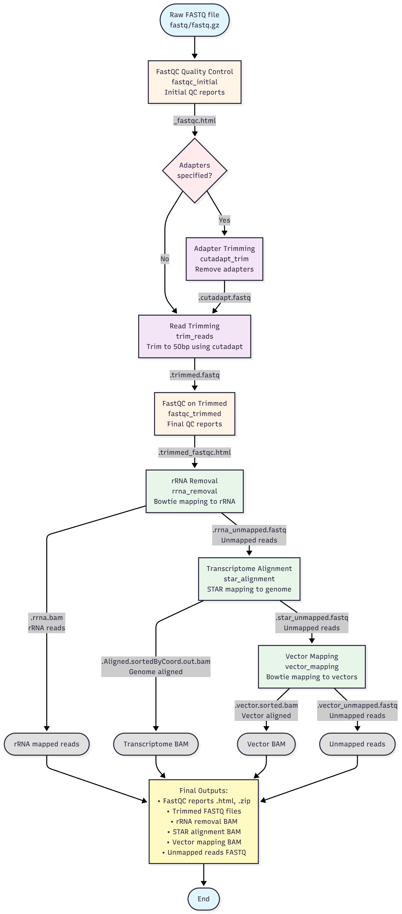

# TotalRNA-seq Processing Pipeline

A Snakemake workflow for processing totalRNA-seq data with rRNA removal and transcriptome alignment.

> **Note**: A unified workflow manager (`./run_workflow.sh`) is available from the project root, providing interactive guidance, automatic resource detection, input validation, and error recovery. See [WORKFLOW_MANAGER.md](../WORKFLOW_MANAGER.md) for details.

## Overview



*The totalRNA-seq workflow processes raw FASTQ files through quality control, optional adapter trimming, read trimming, rRNA removal, transcriptome alignment with STAR, and vector mapping.*

The pipeline performs the following steps:
1. **Quality Control**: Initial FastQC analysis on raw reads
2. **Adapter Trimming**: Optional adapter removal using cutadapt
3. **Read Trimming**: Trims reads to a specified length using cutadapt
4. **Final Quality Control**: FastQC analysis on trimmed reads
5. **Ribosomal RNA Removal**: Maps reads against rRNA references using bowtie
6. **Transcriptome Alignment**: Maps unmapped reads to transcriptome using STAR
7. **Vector Mapping**: Maps unmapped reads to vector sequences using bowtie

## Configuration

Edit `config.yaml` to customize your workflow:

```yaml
# Input file - use totalRNA-seq specific dataset
fastq_file: "../Shared/DataFiles/datasets/totalrna-seq/all.50mers.fastq"

# Read trimming parameters
read_length: 50

# Adapter sequences (leave empty if not trimming adapters)
adapters: ""  # Leave empty if no adapter trimming needed

# Mapping parameters
rrna_index: "../Shared/DataFiles/genome/rrna/dmel_rRNA_unit"
vector_index: "../Shared/DataFiles/genome/YichengVectors/42AB_UBIG"
```

## Direct Snakemake Usage

For advanced users who prefer to run Snakemake directly (instead of using the workflow manager):

```bash
# Run the complete workflow
snakemake --use-conda --cores 8

# Dry run to check what will be executed
snakemake --use-conda --cores 8 --dry-run

# Use mamba for faster environment creation
snakemake --use-conda --conda-frontend mamba --cores 8
```

## Output Files

All outputs are organized in the `results/` directory:

- `results/fastqc_initial/` - Initial FastQC quality reports
- `results/fastqc_trimmed/` - FastQC quality reports after trimming
- `results/cutadapt/` - Adapter-trimmed reads (if adapters specified)
- `results/trimmed/` - Length-trimmed reads
- `results/rrna_removal/` - rRNA mapping results and unmapped reads
- `results/star_alignment/` - STAR alignment results and sorted BAM files
- `results/vector_mapping/` - Vector mapping results and sorted BAM files

## Workflow Rules

- `fastqc_initial`: Initial FastQC quality check
- `cutadapt_trim`: Optional adapter trimming
- `trim_reads`: Read trimming to specified length
- `fastqc_trimmed`: Final quality check on trimmed reads
- `rrna_removal`: Ribosomal RNA removal using bowtie
- `star_alignment`: Transcriptome alignment using STAR
- `vector_mapping`: Vector sequence mapping using bowtie

## Troubleshooting

**Nothing to do (all outputs exist):**
```bash
# Check what Snakemake would run
snakemake --use-conda --cores 8 --dry-run

# Force re-run all steps
snakemake --use-conda --cores 8 --forceall

# Force re-run from a specific rule
snakemake --use-conda --cores 8 --forcerun trim_reads
```

**Incomplete or corrupted outputs:**
```bash
# Remove specific output files and re-run
rm results/star_alignment/*.bam
snakemake --use-conda --cores 8

# Clean all outputs and start fresh
rm -rf results/
snakemake --use-conda --cores 8
```

**Lock directory errors:**
```bash
# Unlock the working directory
snakemake --unlock
```

**Environment issues:**
```bash
# Recreate conda environments
snakemake --use-conda --conda-create-envs-only

# Check Snakemake version
snakemake --version
```

**Debugging:**
```bash
# Dry run to see what will execute
snakemake --use-conda --cores 8 --dry-run

# Verbose output
snakemake --use-conda --cores 8 --verbose

# Print shell commands without executing
snakemake --use-conda --cores 8 --dry-run --printshellcmds
```

## Workflow Diagram

The [workflow diagram](../Shared/DataFiles/workflow_images/totalRNAseq_workflow.png) at the top of this README shows the complete totalRNA-seq analysis pipeline with **specific output file names and types**.

**Key Features:**
- ✅ **Specific File Names**: Shows actual output file naming conventions (e.g., `{sample}_fastqc.html`, `{sample}.trimmed.fastq`)
- ✅ **File Types**: Displays all major file types (.fastq, .bam, .html, .zip)
- ✅ **Branching Paths**: Illustrates conditional adapter trimming and parallel mapping workflows
- ✅ **Output Summary**: Includes a note with key final output files

**Source:** The diagram is defined in [Mermaid format](../Shared/Scripts/mermaid/totalrnaseq_workflow.mmd) and can be viewed/edited directly on GitHub.

**To regenerate the PNG:**
1. Copy the contents of `totalrnaseq_workflow.mmd`
2. Paste into [Mermaid Chart](https://www.mermaidchart.com/)
3. Export as PNG and save to `../../DataFiles/workflow_images/totalRNAseq_workflow.png`

## Related Documentation

- **[Main Project README](../README.md)**: Overview of the entire piRNA workflow project
- **[Workflow Manager Guide](../WORKFLOW_MANAGER.md)**: Detailed usage and troubleshooting

